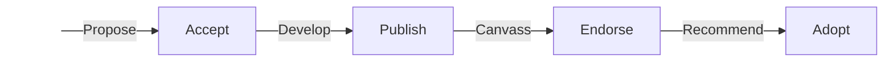

## Description

The SPEC process is designed to identify areas of shared concern between projects
in the scientific Python ecosystem and to produce collaboratively written,
community adopted guidelines for addressing these.
Such guidelines are known as SPECs: Scientific Python Ecosystem Coordination documents.

Specifically, the purpose of the SPEC process is

1. to help unify the ecosystem for users and developers;
2. to provide guidance to projects on technical issues or processes;
3. to document standard APIs, development tools, and community practices; and
4. to foster ecosystem-wide discussions of common problems and to develop shared solutions.

Projects in the ecosystem have an existing, diverse set of proposal processes
and development constraints.
SPECs complement these: they are a mechanism to encourage shared practices and
improve uniformity of experience across projects.
SPECs may, for example, capture established practices so that new projects can
learn from them; or they may propose a new practice that the authors believe
will benefit the ecosystem as a whole.

Projects decide for themselves whether to adopt any given SPEC—often, this
would be through team consensus.
A SPEC may not be a good fit for every single project, and thus there is no
expectation that all SPECs must be adopted by all projects.
That said, SPECs serve their purpose through being adopted by
several projects—and their authority stems from the extent to which they are.

Participants in the SPEC process must adhere to our
[Code of Conduct](https://scientific-python.org/code_of_conduct/).

## What is a SPEC?

A SPEC (Scientific Python Ecosystem Coordination) is a document that captures an idea.
A SPEC is the product of discussions with developers across the ecosystem.
SPECs capture the following types of narratives:

- We recommend that you do X (e.g., [SPEC 8 — Securing the Release Process](https://scientific-python.org/specs/spec-0008/)).
- Some projects may need to do X. If you do X, we recommend that you do it as follows (e.g., [SPEC 1 — Lazy Loading](https://scientific-python.org/specs/spec-0001/)).
- If you do X, you should be aware of the following (we don't have any such advisories yet).


**What a SPEC is not**

SPECs are _not_ meant to be extensive technical documents that capture a large amount of detail.
SPECs typically _summarize_ an idea, referring to external sources for further detail.
These external resources may be GitHub repositories, external websites, etc.

If you find yourself wanting to _disseminate information_ across the
ecosystem, it may be better to write a blog post on
https://blog.scientific-python.org or to contribute to an existing
piece of documentation, such as https://learn.scientific-python.org/development/.
A blog post is also a good mechanism to get initial engagement around
an idea that is not mature enough, or in scope, to become a SPEC.


### Key Terms

Scientific Python Ecosystem
: The **ecosystem** is a loose federation of community developed Python projects
widely used in scientific research that interact well with one another and that
follow similar norms of development, documentation, testing, and so forth.

SPEC Core Projects
: The [Core Projects](/specs/core-projects)
are a small subset of the ecosystem consisting of mature, community developed projects
that are (a) depended upon by most of the other projects and (b) responsible for
reviewing, discussing, implementing, and endorsing SPEC documents.

SPEC Steering Committee
: The [Steering Committee](/specs/steering-committee) leads the SPEC project and
manages the SPEC process including moderating
the [SPECs discussion forum](https://discuss.scientific-python.org/c/specs/),
accepting SPEC documents, and maintaining the SPEC process documents.

SPEC Process
: The SPEC process is outlined in this document and the associated
[SPEC Steering Committee](/specs/steering-committee) and
[SPEC Core Projects](/specs/core-projects) documents.
This process is managed and overseen by the Steering Committee, and functions in collaboration
with the Core Projects, community members, and projects across the ecosystem.

SPEC Document
: A **SPEC document** provides operational guidelines for projects and helps
coordinate the ecosystem to provide a more unified experience for users and developers.
These documents are developed collaboratively with the Core Projects and other interested
ecosystem projects and community members.

### Format

SPECs are UTF-8 encoded text files using
[Markdown](https://www.markdownguide.org/) format and stored in the
[SPEC repository](https://github.com/scientific-python/specs).
The SPEC documents are converted to HTML by code in the
[scientific-python.org repository](https://github.com/scientific-python/scientific-python.org/) using
[Hugo](https://gohugo.io/) and deployed to
[https://scientific-python.org/specs/](https://scientific-python.org/specs/).
Each SPEC has two corresponding discussions: one under [SPECS → Ideas](https://discuss.scientific-python.org/c/specs/ideas), where the SPEC committee discussed its viability, and another under [SPECS → Web Comments](https://discuss.scientific-python.org/c/specs/web-comments), where public comments from https://scientific-python.org/specs are stored.

## Implementation

The Steering Committee manages the SPEC process and will provide guidance to contributors
throughout the process.
In this section, we provide an overview of the main decision points in the SPEC process
and provide guidance for how to get started with a new SPEC proposal.

### Decision Points

A SPEC passes through four decision points over the course of
its development and implementation:
**Accept**, **Publish**, **Endorse**, and **Adopt**.

<!-- prettier-ignore-start -->

<!-- prettier-ignore-end -->

The authors starts by _proposing_ a SPEC idea, as outlined in [New
SPEC Proposals](#new-spec-proposals)—please read that section carefully before
proposing a new SPEC.

The decision to **accept** (and number) a SPEC into draft state is made by the Steering Committee,
at which point it is added to the main branch of the [SPEC
repository](https://github.com/scientific-python/specs), clearly
labeled as a draft.
Proposed SPECs are accepted once (a) there is agreement that the SPEC
concept is applicable to the ecosystem, (b) a draft pull request is
written to clearly explain the area of common concern and a general
approach to a shared solution, and (c) there are contributors (from at least two Core
Projects) interested in working on the new SPEC and in championing it
to their projects as well as the larger community.
Additional details may be found in [Steering Committee
documentation](/specs/steering-committee).

In the accepted phase, the authors _develop_ their SPEC, in
consultation with Core Projects and interested community members.
This is done in a collabortive and iterative process, focused on
ensuring that the SPEC is broadly applicable and likely to be widely
adopted.
The intent is that most SPECs will have authors from several projects,
including Core Projects.
Once authors consider their SPEC complete, they **publish** it,
removing its draft status.

The author now _canvasses_ their project with the Core Projects, so
they may **endorse** it.
Once a SPEC is endorsed, substantive changes require the approval of
all endorsing Core Projects.

A SPEC is _recommended_ for wide-spread adoption once it is endorsed by
two (or more) Core Projects.
Additional details may be found in [Core Project
documentation](/specs/core-projects).
Individual projects choose to **adopt** the SPEC according to their
own decision-making processes.
Each SPEC describes what adopting it means in its _Ecosystem Adoption_ section.
Ecosystem projects are welcome to adopt a SPEC at any point in the
process, however, it may make sense to wait until a SPEC is endorsed
by several Core Projects to ensure that the SPEC has been vetted and
is deemed stable enough for widespread adoption.
Once a SPEC is endorsed, it may still evolve, but the barrier for
modifying the SPEC will increase substantially (since all endorsing
projects would need to agree to changes).
Projects that adopt a SPEC early should engage in the collaborative
process leading to the SPEC being endorsed by the Core Projects, to
ensure that their use cases are incorporated.

#### Badges

Projects can highlight their adoption of specific SPECs with a SPEC badge.
For example, for SPEC 0, we recommend using



[[tab]]
name = 'Rendered badge'
content = '''
[](https://scientific-python.org/specs/spec-0000/)
'''

[[tab]]
name = 'Markdown'
content = '''

```
[](https://scientific-python.org/specs/spec-0000/)
```

'''

[[tab]]
name = 'reStructuredText'
content = '''

```
|SPEC 0 — Minimum Supported Dependencies|

.. |SPEC 0 — Minimum Supported Dependencies| image:: https://img.shields.io/badge/SPEC-0-green?labelColor=%23004811&color=%235CA038
   :target: https://scientific-python.org/specs/spec-0000/
```

'''



Alternatively, you can use one badge to indicate adoption of multiple SPECs.
For example, to indicate adoption of SPECs 0, 1, and 4, we recommend the following



[[tab]]
name = 'Rendered badge'
content = '''
[](https://scientific-python.org/specs/)
'''

[[tab]]
name = 'Markdown'
content = '''

```
[](https://scientific-python.org/specs/)
```

'''

[[tab]]
name = 'reStructuredText'
content = '''

```
|Scientific Python Ecosystem Coordination|

.. |Scientific Python Ecosystem Coordination| image:: https://img.shields.io/badge/SPEC-0,1,4-green?labelColor=%23004811&color=%235CA038
   :target: https://scientific-python.org/specs/
```

'''



### New SPEC Proposals

A good SPEC proposal focuses on a single key recommendation or idea
for coordinating projects in the scientific Python ecosystem. Please
also see the [What is a SPEC?](#what-is-a-spec) section above.

**Before proposing** a SPEC, we highly recommended that you first **vet
the idea** by doing one or more of the following:

1. discuss the idea with at least one project in the ecosystem,
2. discuss the idea with at least one other member of the ecosystem, or
3. if it is a technical idea, create a minimal proof of concept.

**Before submitting** a proposed SPEC:

1. The **idea must be proposed** on the discussion forum under the [`SPECS/Ideas`
   topic](https://discuss.scientific-python.org/c/specs/ideas/9).

2. If the SPEC committee considers the idea suitable for a SPEC, a
   number will be allocated.

At this point, you should **draft your SPEC document and submit it**
via pull request to the [SPEC repository](https://github.com/scientific-python/specs).

Use the `quickstart.py` script to create the new SPEC document.
Located at the top-level of the [SPEC
repository](https://github.com/scientific-python/specs), the script
will ask you a few questions[^newspec] and then create a new file
appropriately named with a basic template for you to complete (e.g.,
`spec-0000/index.md`).
Leave the `draft` field set to `true` and the `endorsed-by` field empty.
Once the SPEC is in reasonable shape, file a pull request against the
[SPEC repository](https://github.com/scientific-python/specs).

## Notes

[^newspec]:
    The script currently only supports adding one author.
    If you need to add additional authors, just edit the text file.

    Additional files associated with a SPEC document may be kept in the directory
    containing the SPEC.
    For example, files associated with `spec-0000/index.md` are in `spec-0000/`.
