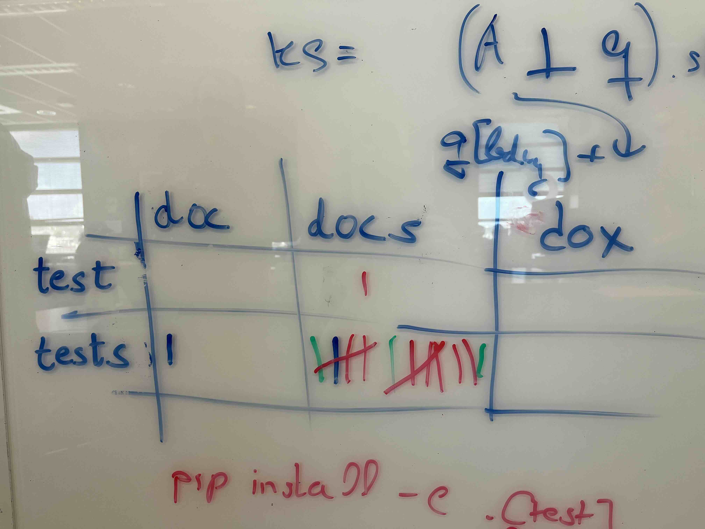

## Description

For consistency and decreased cognitive load across the ecosystem, this SPEC recommends naming conventions around various project aspects--such as project structure, repository layout, folder names, task runner and `pyproject.toml` targets name.

From a cursory survey in the Scientific Python ecosystem, we discover some frustration from contributors and maintainer when moving from one project to another and belive that consistency will make it both easier for existing maintainer to contribute to manz project as well a decreae the confusion of new developers when contributing or creating new proejcts.

## Implementation

We recommend that  by default the targets and folder names:
 - related to testing be named `tests` (and not `test`)
 - related to documentation be named `docs` (and not `doc`)
 - both should be lowercase.

It is ok to have the singular aliases, but the plurals should always be the default.

### Examples

pyproj.toml
docs folder
pip install .[] 
spin and dev.py
tox

## Notes

